# 👋 你好，这里是 OLC

### 一个普通的随心而为的程序开发者

---

## 📌 个人介绍

<table>
  <tr>
    <td width="50%" valign="top">
      
### 🆔 常用 ID

- **OLC**
- **BAKAOLC**
- **律影映幻**
- **Ritsukage Utsumabo**

</td>
<td width="50%" valign="top">

### 📱 联系方式

</td>
  </tr>
</table>

---

## 📊 GitHub 统计

<picture>
  <source media="(prefers-color-scheme: dark)" srcset="./profile/stats-dark.svg">
  <source media="(prefers-color-scheme: light)" srcset="./profile/stats-light.svg">
  
</picture>

<picture>
  <source media="(prefers-color-scheme: dark)" srcset="./profile/top-langs-dark.svg">
  <source media="(prefers-color-scheme: light)" srcset="./profile/top-langs-light.svg">
  
</picture>

---

## 💖 赞助支持

如果我的项目对你有帮助，欢迎赞助支持！你的支持是我持续创作的动力 ✨

---

  💫 感谢你的访问！欢迎探索我的其他项目 💫

